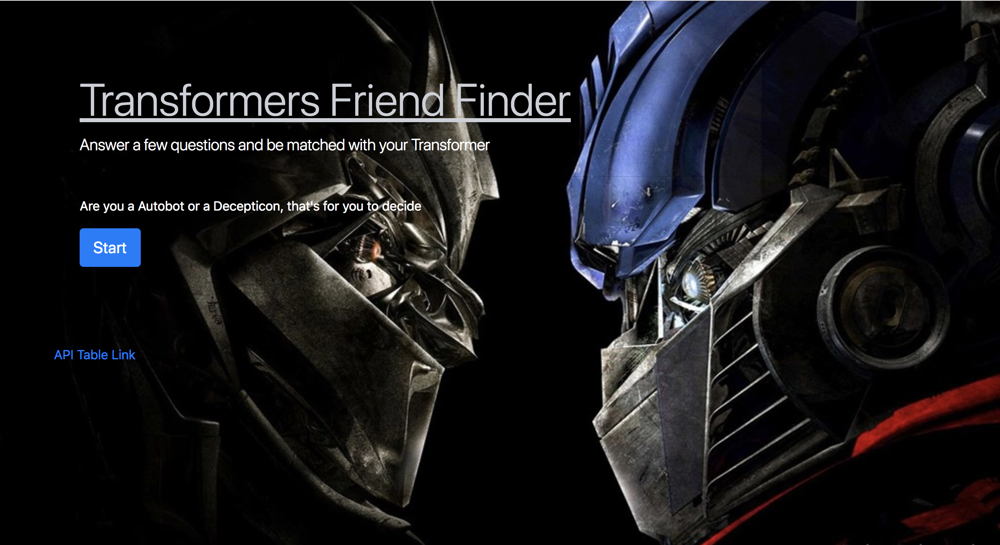
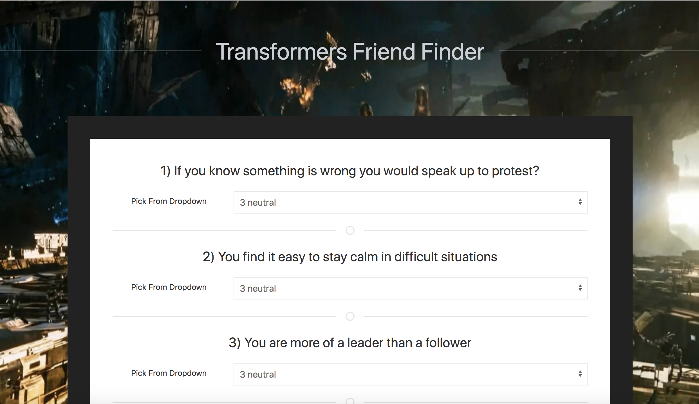

# Friend-Finder

This program is a Friend Finder but... the theme is Transformer Prime, so you can take the quiz and be matched with one of the following transformers:
- Megatron
- Optimus Prime
- Bumble Bee
- Knock Out
- Predaking
- Ratchet
- Shockwave

[Friend Finder](file:///Users/muhammadawais/Desktop/Friend-Finder/app/public/home.html)

[Portfolio](https://mawais54013.github.io/New-Portfolio/)

# Images 


The home page includes a api link to the characters and a start button to have a quiz and be matched.



When the button is clicked then this is the page the comes up for the user to answer the questions(10) and get matched. 

# Technology Used
- Javascript
- Node.js
- Express.js
- Terminal
- UIkit
- JSON
- NPM
- HTML
- CSS
- Bootstrap
- Heroku

# Code Snippets
1) This code sets us the browser and api call for which html should be shown. First the main home.html will be shown and when the user clicks on the start button then the api changes to survey and shows the survey.html page.
```
app.get("/survey", function (req, res) {
    res.sendFile(path.join(__dirname, "../public/survey.html"));
    // survey.html
});

app.get("*", function (req, res) {
    res.sendFile(path.join(__dirname, "../public/home.html"));
    // main page html
});
```

2) This code takes the user's answers as picked and sends them to the api route js file to check and once the answer has been checked with each characters then the response is an array object of a character which is then formated in the following fashion to be shown in a modal. Data is the information about the character that is sent back. This shows the name and photo of the character. 
```
$.post("/api/friends", picked, function(data)
{
    // once a match is found them it is displayed in this format
    // with data the information that comes back 
    var section = $("<div>");
        section.addClass("userTransformer");
        section.attr("id","user-well");
        section.append("<h1> Your Transformer isss.... </h1>");
        section.append("<h2>Name: " + data.name + "</h2>");
        section.append("");
        $("#displayMatch").append(section);
});
```
# Author 
[Muhammad Awais](https://github.com/mawais54013/Bootstrap-Portfolio)
